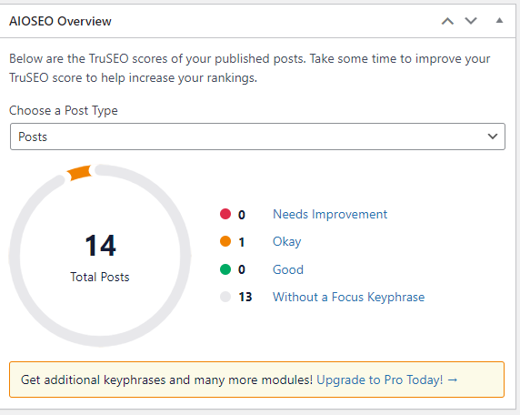

# 📈 WordPress SEO & Performance Optimization

## Project Overview
This project demonstrates the impact of professional SEO configuration and performance tuning on a live WordPress site. Using industry-standard tools like **AIOSEO** and **MonsterInsights**, I achieved a significant growth in site visibility and user engagement.

## 📊 Results & Analytics
The most prominent result was a **100% increase** in key metrics including sessions, pageviews, and total users within a 30-day period.

## 🛠️ Optimization Steps

### 1. SEO Content Audit (Before)
Initially, many posts lacked focus keyphrases and proper SEO metadata, leading to low search engine rankings.

### 2. Implementation
* **Technical SEO:** Configured XML Sitemaps, Robots.txt, and Schema Markup.
* **On-Page SEO:** Optimized titles, meta descriptions, and image alt texts.
* **Analytics Setup:** Integrated Google Analytics via MonsterInsights for real-time tracking.

## ✅ Conclusion
The data proves that proper SEO implementation directly correlates with traffic growth and better user retention.

---
*By Nadia Al-Hassan*
